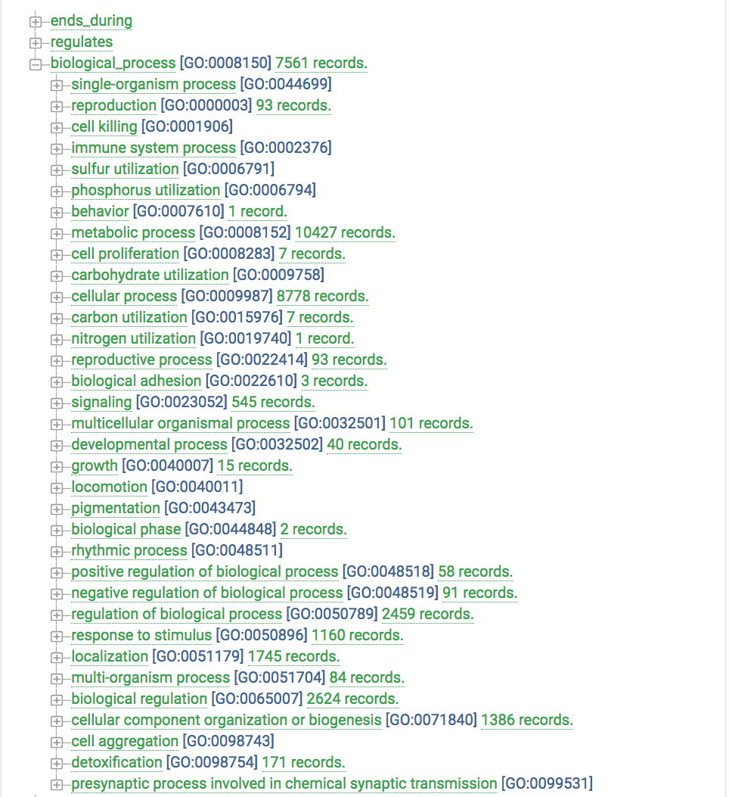
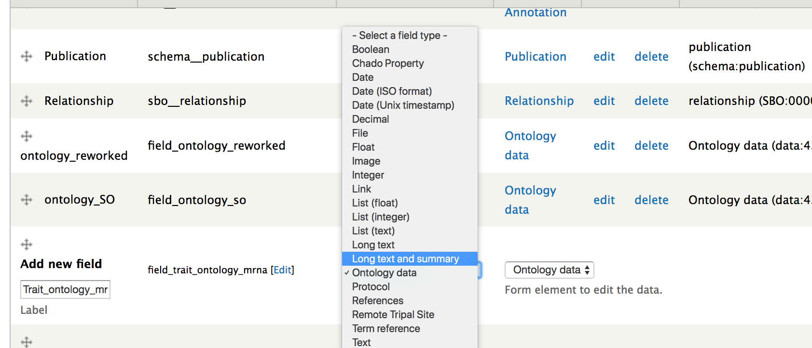
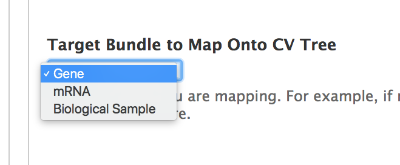

Tripal CV X-ray provides browseable CV trees with entity counts and links.  It does this by associating your entities with CVterms, and then mapping entities of one type onto another. 

# Features

* Customizable fields
* Support for Feature -> Organism mappings
* Support for Biomaterial -> Organism mappings

>The ontology tree on an organism, showing the number of records associated with each term (and its children terms).

>Clicking on the entity record link in the tree provides the user with a browseable list of entities.

## Coming Soon

* Support for Biomaterial -> Analysis mappings
* "Site wide" page

# Documentation

CV X-ray provides a field that links entities and CVterms.  When an instance of the field is created, the **anchor bundle** is the bundle that the field attaches to. The **mapping bundle** is the bundle that provides the entities which will be mapped onto the CV tree.  The field will only present **mapped entities** that are related to the **anchor entity** the field is attached to.

The following relationships are currently supported:

* Organism <- feature
* Organism <- biomaterial

### Indexing entity : CVterm relationships

CV X-ray needs to associate mapping entities with CVterms beforehand.  The admin form has two sets of parameters: CVs and mapping entities.  To minimize the footprint of CV X-ray, you should only index mapping entities and CVs you plan to use for your fields.

CV X-ray works best on CVs with well structured relationships.  CVs with too many root terms (INTERPRO for example) just won't look good: the browser paginates after 20 root terms.

Once you've selected the CV and mapping entities you'd like to include in your fields, run the indexing job.

Indexing occurs in a batch of cron-managed jobs to prevent memory leaks.  

### Creating a field instance

Once your index is populated, you can create field instances.  You can only create a field instance for supported bundles: CV-Xray has to know how to link the mapping and anchor entities, via Chado.

Navigate to the manage fields area of the organisms bundle. Add a **new** field, and select **Ontology Data** for the field type.  You will need a seperate field for each bundle:CV combination.  If you have multiple feature bundles, for example, you will need a seperate field instance for each.  Click save at the bottom of the screen.

You will be redirected to the field settings page.  Scroll down to the instance settings.  Select an Ontology and a Mapping Bundle type.  Valid chado base tables include feature and biomaterial.

Click hte save Settings button at the bottom.  Navigate to the "Manage Display" section of your bundle, and enable your new field.
